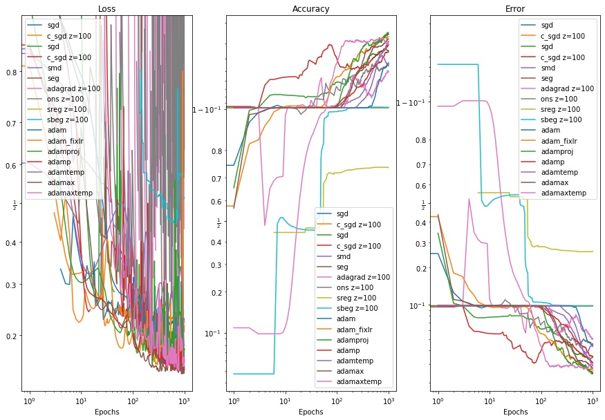

# Online Sequential Optimization

Course from O. Wintenberger for Master M2A @ Sorbonne Université.   
Website: http://wintenberger.fr/ens.html

## Implemented Algorithms
- Gradient Descent, Constrained Gradient Descent 
- Stochastic Gradient Descent, Constrained SGD
- Regularized Follow the Leader (RFTL) variants: Stochastic Mirror Descent (SMD), Stochatic Exponential Gradient (SEG), Adaptative Gradient (AdaGrad)
- Bandits: SREG, SBEG
- ADAM variant: Adam, Projected Adam, AdaMax, Adam Temporal, Adamax Temporal

## Getting Started
The MNIST data set can be downloaded from http://yann.lecun.com/exdb/mnist/  
The notebook main.ipynb contains a sandbox for all the implemented algorithm for the user to experiment with the hyperparameters and compare respective performances.  
All the algorithms are benchmarked in a binary classification problem, tuning a linear SVM for model.

## Default config results

## Contributors
Lise Le Boudec, Paul Liautaud, Nicolas Olivain
